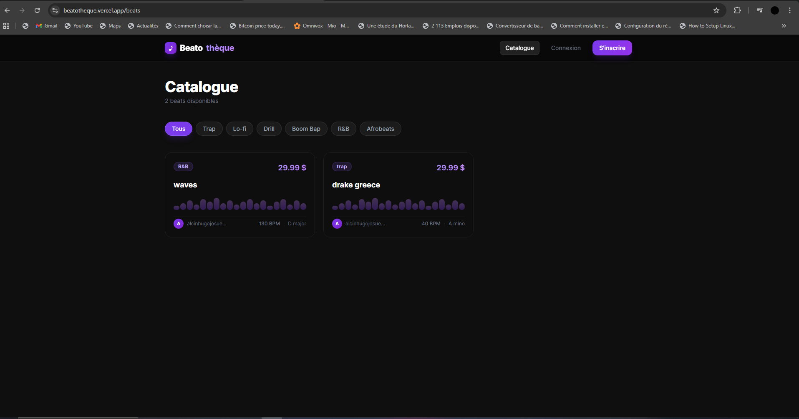
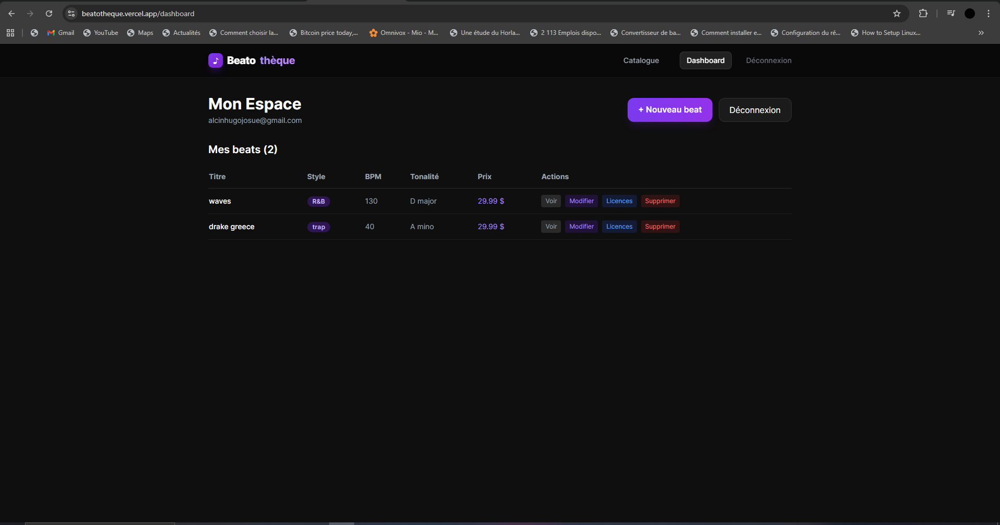
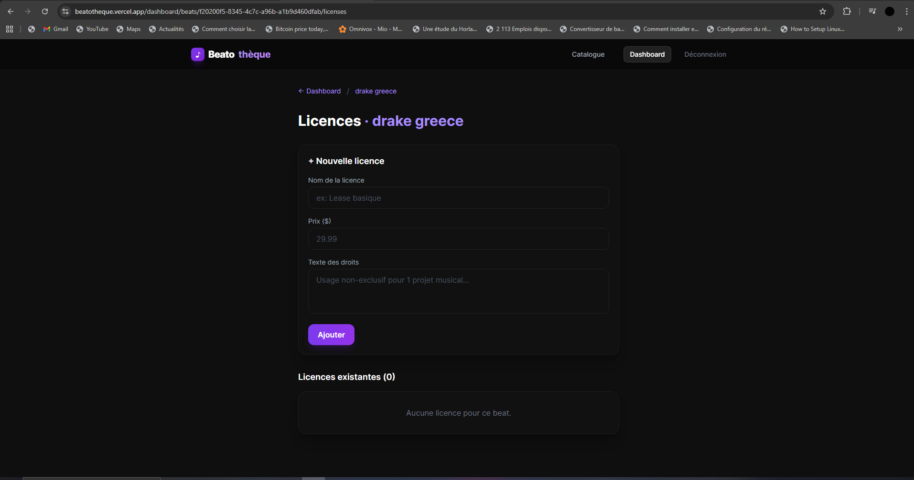

# Beatothèque

> Application web full-stack de gestion d'une bibliothèque de beats musicaux et de leurs licences.

**Dépôt GitHub :** https://github.com/HugoJosue/beatotheque

---

## 1. Description du projet

### Objectif
Beatothèque permet à des producteurs musicaux de publier leurs beats, de les organiser par style, BPM et tonalité, et de définir des licences (lease, exclusif, etc.) que les acheteurs potentiels peuvent consulter.

### Fonctionnalités principales
- **Catalogue public** : liste et recherche de beats avec filtre par style, pagination
- **Authentification JWT** : inscription, connexion sécurisée, déconnexion
- **Dashboard producteur** : CRUD complet sur ses propres beats
- **Upload audio** : fichiers MP3/WAV stockés sur Vercel Blob (max 50 Mo)
- **Gestion des licences** : création et modification de licences par beat
- **Ownership** : un utilisateur ne peut modifier/supprimer que SES ressources
- **Interface responsive** : adaptée mobile et desktop

---

## 2. Technologies utilisées

| Technologie       | Version  | Rôle                                |
|-------------------|----------|-------------------------------------|
| Next.js           | 14.2.5   | Framework full-stack (App Router)   |
| React             | 18.3     | Interface utilisateur               |
| TypeScript        | 5.5      | Typage strict                       |
| Prisma            | 5.14     | ORM — accès PostgreSQL              |
| PostgreSQL (Neon) | —        | Base de données serverless          |
| Tailwind CSS      | 3.4      | Styles utilitaires                  |
| jose              | 5.6      | JWT (compatible Edge runtime)       |
| bcryptjs          | 2.4      | Hachage des mots de passe           |
| Zod               | 3.23     | Validation des données              |
| @vercel/blob      | 2.3      | Stockage des fichiers audio         |

---

## 3. Structure du projet

```
beatotheque/
├── backend/               # Logique métier
│   ├── controllers/       # Auth, beats, licences
│   ├── lib/               # JWT, auth, validations, api-response
│   ├── models/            # Interfaces TypeScript
│   └── prisma/            # Client Prisma
├── frontend/              # Composants React réutilisables
│   └── components/        # Navbar, BeatCard, BeatForm, LicenseCard
├── src/app/               # Pages et routes Next.js (App Router)
│   ├── api/               # Endpoints REST (auth, beats, licences, upload)
│   ├── beats/             # Page catalogue public
│   ├── dashboard/         # Pages protégées producteur
│   ├── login/             # Page connexion
│   └── register/          # Page inscription
├── prisma/                # Schéma de base de données
└── public/                # Fichiers statiques
```

---

## 4. Modèle de données

- **User** : id, email, passwordHash, createdAt
- **Beat** : id, title, bpm, style, key, price, previewUrl, userId, createdAt
- **License** : id, name, price, rightsText, beatId, createdAt

---

## 5. Instructions d'installation

### Prérequis
- Node.js 18+
- Un projet [Neon](https://neon.tech) (PostgreSQL gratuit)
- Un projet [Vercel](https://vercel.com) avec Blob activé (pour l'upload)

### Étapes

```bash
# 1. Cloner le dépôt
git clone https://github.com/HugoJosue/beatotheque.git
cd beatotheque

# 2. Installer les dépendances
npm install

# 3. Configurer les variables d'environnement
cp .env.example .env
# → Remplir les variables dans .env (voir section 6)

# 4. Générer le client Prisma et appliquer le schéma
npm run db:push

# 5. Lancer le serveur de développement
npm run dev
```

L'application est disponible sur **http://localhost:3000**

### Commandes utiles

```bash
npm run dev          # Serveur de développement
npm run build        # Build de production
npm run db:studio    # Interface visuelle Prisma
npm run db:push      # Appliquer le schéma en base
npm run db:migrate   # Migration avec historique (prod)
```

---

## 6. Variables d'environnement

| Variable               | Description                                 | Obligatoire |
|------------------------|---------------------------------------------|-------------|
| `DATABASE_URL`         | URL Neon PostgreSQL avec `?sslmode=require` | ✅          |
| `JWT_SECRET`           | Clé secrète JWT (min. 32 caractères)        | ✅          |
| `BLOB_READ_WRITE_TOKEN`| Token Vercel Blob (upload audio)            | ✅          |
| `NEXT_PUBLIC_BASE_URL` | URL de base (ex: `http://localhost:3000`)   | Optionnel   |
| `JWT_EXPIRES_IN`       | Durée du token (défaut: `7d`)               | Optionnel   |

> **Important :** Ne jamais committer le fichier `.env`.

---

## 7. Déploiement (Vercel)

1. Importer le repo GitHub sur [vercel.com](https://vercel.com)
2. Ajouter les variables d'environnement dans **Settings → Environment Variables**
3. Activer **Vercel Blob** dans **Storage** et connecter au projet
4. Déployer — le build exécute automatiquement `prisma generate && next build`

---

## 8. Tests API (curl)

### Inscription
```bash
curl -X POST http://localhost:3000/api/auth/register \
  -H "Content-Type: application/json" \
  -d '{"email":"test@exemple.com","password":"motdepasse123"}'
```

### Connexion
```bash
curl -X POST http://localhost:3000/api/auth/login \
  -H "Content-Type: application/json" \
  -c cookies.txt \
  -d '{"email":"test@exemple.com","password":"motdepasse123"}'
```

### Créer un beat (authentifié)
```bash
curl -X POST http://localhost:3000/api/beats \
  -H "Content-Type: application/json" \
  -b cookies.txt \
  -d '{"title":"Test Beat","bpm":140,"style":"Trap","key":"A minor","price":29.99,"previewUrl":"https://exemple.com/beat.mp3"}'
```

### Liste des beats (public)
```bash
curl "http://localhost:3000/api/beats?style=Trap&page=1&limit=5"
```

### Ajouter une licence
```bash
curl -X POST http://localhost:3000/api/beats/{BEAT_ID}/licenses \
  -H "Content-Type: application/json" \
  -b cookies.txt \
  -d '{"name":"Lease basique","price":29.99,"rightsText":"Usage non-exclusif pour 1 projet musical."}'
```

---

## 9. Captures d'écran

### Catalogue public


### Dashboard producteur


### Gestion des licences


---

## 10. Auteur(s)

| Nom | Matricule |
|-----|-----------|
| Hugo Josue Alcin | 2171623 |
